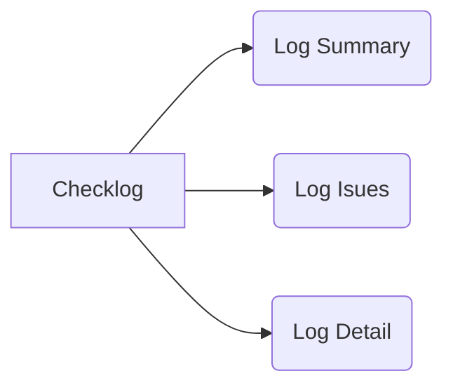

# 需求文档

## 一、业务需求

实现自动检查Log文件中存在的问题，为用户提供方便快捷的查看。

## 二、基本结构
建议分三部分完成：

第一部分是log check summary，包括总共scan了多少个log files，log clear 有几个，log issue的有几个，以及log path的位置；

第二部分是issue list，列出issue的类型，实现搜索日志文件的error和warning、部分note，并指出具体log行。实现点击link跳转到log details的功能。有些log issue是不可避免的情况下出现的，需要在相应的issue位置写出出现改issue的原因，以作为核查的一个文档;

第三部分是the details of log issue，

针对有log issue的 file，列出完整的log，并高亮标注出log issue的部分。

## 三、功能说明
       
模块|功能|说明
---------|----------|---------
Summary | 1.统计含有issue的文件数 2.读取目录下每个log文件路径和文件名 3.显示出log出错的数目  4.显示文件相对路径。   | 显示待处理的含issue的log信息
Issues|列出issue文件名和issue类型，含有定位链接，具有点击跳转至对应log detail的功能| 列表仅保留有以下字符串的观测值：ERROR\WARNING\一些note比如：字符型转化为数值型等
Detail| 输出要处理的完整log| 方便用户查找错误并修改

